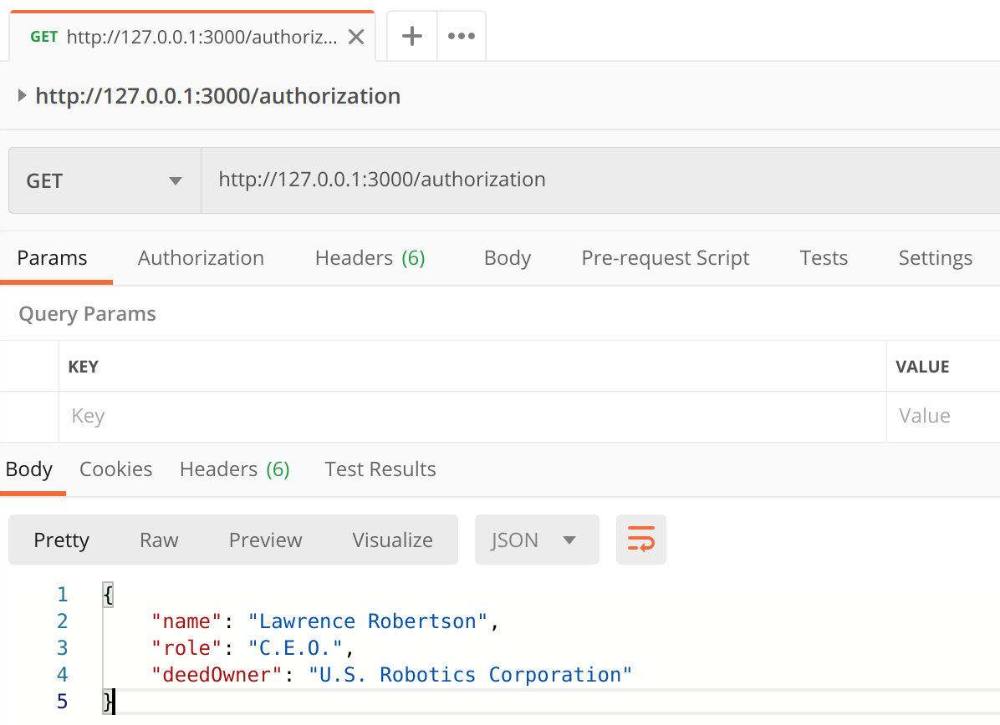
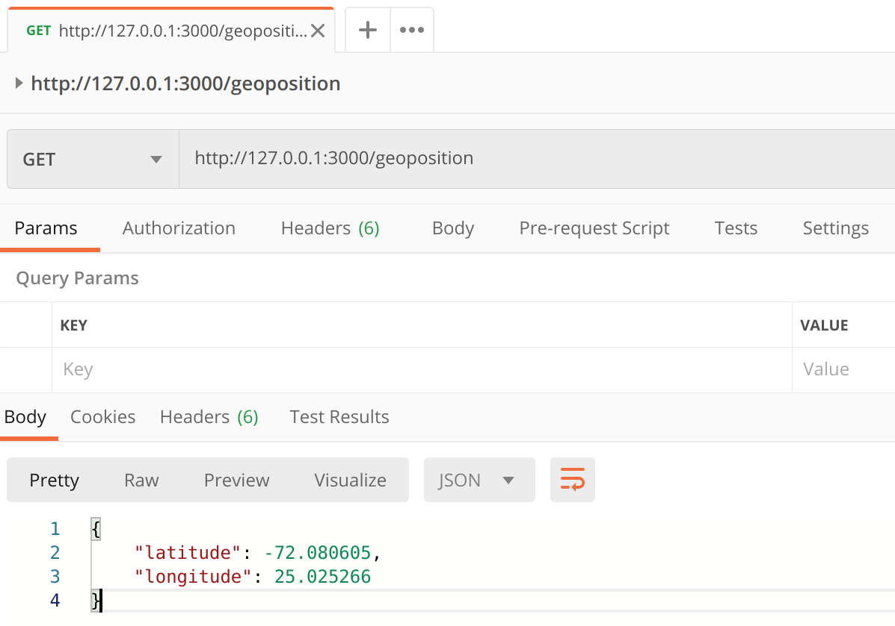
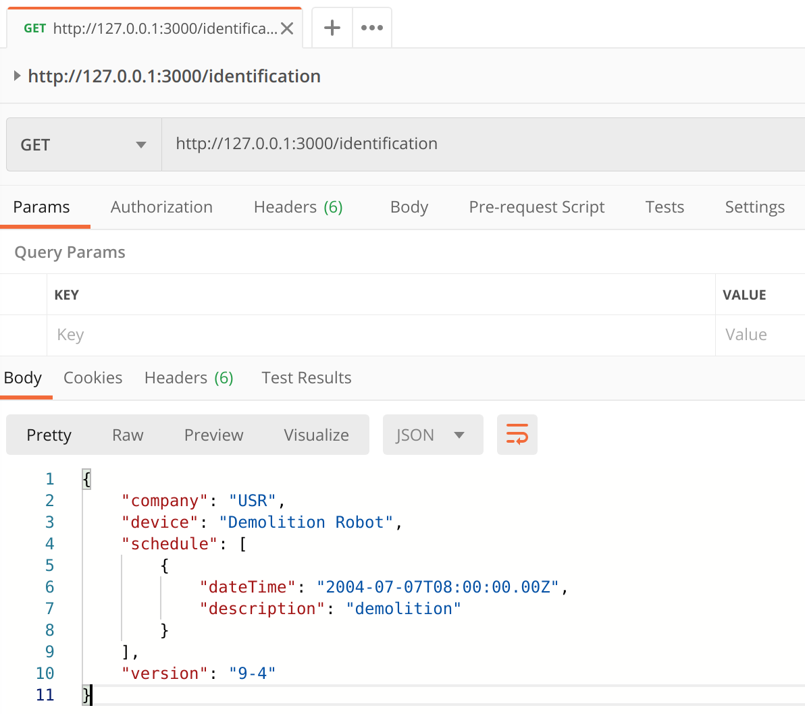
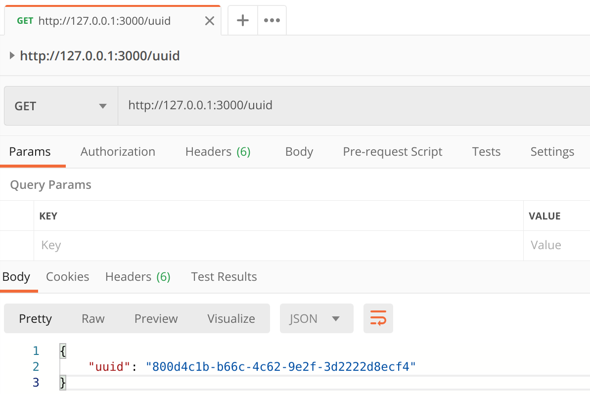
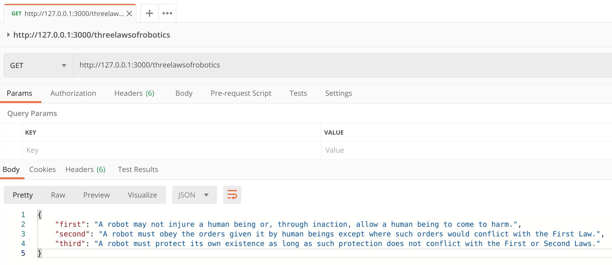
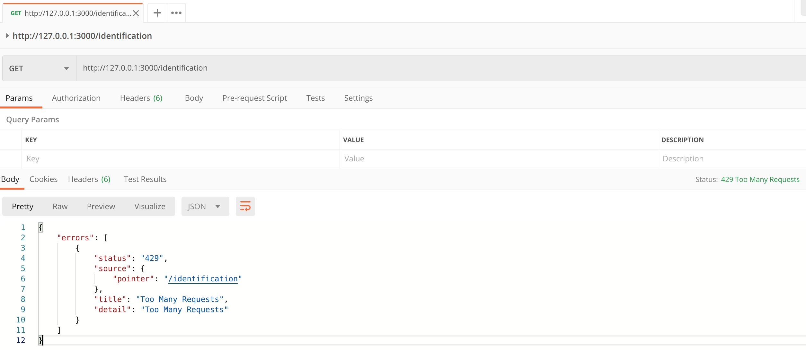

# iot-device-information

iot-device-information was inspired by the movie I, Robot (see https://www.imdb.com/title/tt0343818/).
In one scene a demolition robot is asked for its identification and its authorization for the task to be performed.
You can run iot-device-information on your IoT device to give detailed information about its purpose and its owner.

## Requirements

In order to use iot-device-information you need an installation of Node.js. iot-device-information was developed with Node.js version v14.16.1.

## Features

### Register

Publishes a register message to an MQTT broker on startup. The connection details for the MQTT broker can be edited in the configuration.json.

```
{
    "authorization": {
        "name": "Lawrence Robertson",
        "role": "C.E.O.",
        "deedOwner": "U.S. Robotics Corporation"
    },
    "geoposition": {
        "latitude": -72.080605,
        "longitude": 25.025266
    },
    "identification": {
        "company": "USR",
        "device": "Demolition Robot",
        "schedule": [
            {
                "dateTime": "2004-07-07T08:00:00.00Z",
                "description": "demolition"
            }
        ],
        "version": "9-4"
    },
    "timestamp": "2004-07-06T08:00:00.00Z",
    "uuid": "551a82e3-6016-42e3-943e-3fcc4832dc7c"
}
```

### Authorization

Returns information about the owner of the device.

* Request method: GET
* Endpoint: /authorization
* File containing the response: authorization.json

Replace the values given in authorization.json with values for your device.



### Geo Position

Returns information about the geo position of the device.

* Request method: GET
* Endpoint: /geoposition
* File containing the response: geoposition.json

Replace the values given in geoposition.json with values for your device.



### Identification

Returns information about the device, the device version, and its purpose.

* Request method: GET
* Endpoint: /identification
* File containing the response: identification.json

Replace the values given in identification.json with values for your device.



### UUID

Returns the device ID.

* Request method: GET
* Endpoint: /uuid
* File containing the response: uuid.json

The UUID is generated and saved to a file named uuid.json. This file should not be edited.



### Three Laws Of Robotics

Returns the Three Laws of Robotics.

* Request method: GET
* Endpoint: /threelawsofrobotics
* File containing the response: threeLawsOfRobotics.json

There is no need to edit the Three Laws of Robotics.



### Throttle

Requests are limited to 15 requests per minute at a rate of one request every four seconds.

